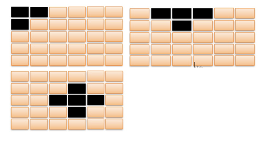
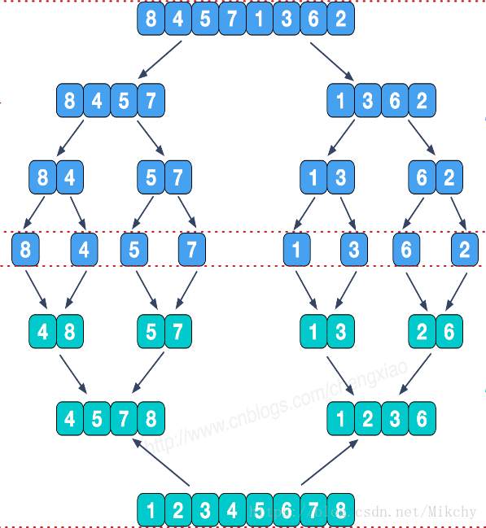

# [USTB程序设计I](http://202.204.62.165/assignment/programList.jsp?proNum=1)（I和II已经在23年合并）

    提醒：请不要完全复制粘贴，部分文件会有老师进行人工审核，仅供参考。
    提醒：请不要完全复制粘贴，部分文件会有老师进行人工审核，仅供参考。
    提醒：请不要完全复制粘贴，部分文件会有老师进行人工审核，仅供参考。

## 目前进度
1. [x] 专项练习1  
2. [x] 专项练习2  
3. [x] 专项练习3  
4. [x] 专项练习4  
5. [ ] 专项练习5  
6. [x] 哈利波特检索

- [USTB程序设计I（I和II已经在23年合并）](#ustb程序设计ii和ii已经在23年合并)
  - [目前进度](#目前进度)
  - [以下为题目参考](#以下为题目参考)
    - [综合练习1（流程图、算法与简单数据结构）](#综合练习1流程图算法与简单数据结构)
      - [1. 二进制整数转换为十进制整数](#1-二进制整数转换为十进制整数)
      - [2. 判断质数](#2-判断质数)
      - [3. 猴子选大王(链表)](#3-猴子选大王链表)
      - [1. 流程图绘制2：要求绘制解决问题的算法（谁拿了最多奖学金）](#1-流程图绘制2要求绘制解决问题的算法谁拿了最多奖学金)
      - [2. 流程图绘制1：要求绘制解决问题的算法](#2-流程图绘制1要求绘制解决问题的算法)
    - [综合练习2 （内存管理与指针）](#综合练习2-内存管理与指针)
      - [1. 字符串子串统计](#1-字符串子串统计)
      - [2. 求三维空间的最小距离和](#2-求三维空间的最小距离和)
      - [3. 序列重排](#3-序列重排)
      - [4. 数据循环移动](#4-数据循环移动)
      - [5. 模拟内存管理](#5-模拟内存管理)
    - [综合练习3 （面向对象的程序设计）](#综合练习3-面向对象的程序设计)
      - [1. 设计并实现课程类](#1-设计并实现课程类)
      - [2. 设计并实现学生类和专业类](#2-设计并实现学生类和专业类)
      - [3. 设计并实现游戏人物类和人物位置类](#3-设计并实现游戏人物类和人物位置类)
      - [4. 设计并实现栈类](#4-设计并实现栈类)
      - [5. 设计并实现扫描仪类，打印机类和一体机类](#5-设计并实现扫描仪类打印机类和一体机类)
    - [综合练习4 （调试+程序阅读理解+改错）（文件详见exercise4）](#综合练习4-调试程序阅读理解改错文件详见exercise4)
      - [1. 大数乘法代码改错](#1-大数乘法代码改错)
      - [2. 计算器小程序阅读并改错](#2-计算器小程序阅读并改错)
      - [3. 冒泡排序算法的错误改正](#3-冒泡排序算法的错误改正)
      - [4. 模拟占座代码改错](#4-模拟占座代码改错)
    - [综合练习5 （综合算法练习）](#综合练习5-综合算法练习)
      - [1. 拿硬币](#1-拿硬币)
      - [2. 红与灰](#2-红与灰)
      - [3. (5. 枚举题) 苹果消消乐](#3-5-枚举题-苹果消消乐)
      - [4. （5. 枚举题）熄灯问题](#4-5-枚举题熄灯问题)
      - [5. （5. 递归题）递归算法4：算24](#5-5-递归题递归算法4算24)
      - [6. （5. 递归）归并排序](#6-5-递归归并排序)
      - [7. （5. 递归题）：快速排序](#7-5-递归题快速排序)
      - [8. （枚举题）最大的湖泊](#8-枚举题最大的湖泊)
    - [2022综合练习：哈利波特检索](#2022综合练习哈利波特检索)
      - [1. 哈利波特书籍检索-界面要求](#1-哈利波特书籍检索-界面要求)

## 以下为题目参考
### 综合练习1（流程图、算法与简单数据结构）
#### 1. 二进制整数转换为十进制整数  
【问题描述】

编写程序，输入字符串形式的二进制整数（长度为16位，采用补码表示），把它转换为十进制整数，输出该十进制整数。补码首位表示符号，0代表正数，1代表负数。

需要注意的是：求负整数的补码，将其对应正数二进制表示所有位取反（包括符号位，0变1，1变0）后加1。

【输入形式】

输入一个16位补码表示的二进制整数
【输出形式】

二进制整数对应的十进制数
【样例输入】

0000000000001101

【样例输出】

13
#### 2. 判断质数
【问题描述】

给定0 <= n <= 40000，判定n是否为素数。如果是素数输出"Y"，反之输出"N"

【输入形式】

共一行，有一个整数n。
【输出形式】

共一行，一个字符'Y'或'N'，表示n是否为素数。
【样例输入】

3
【样例输出】

Y
【样例说明】

3是素数，所以输出"Y"。
【评分标准】

对于20%的数据，n <= 10。

对于100%的数据，n <= 40000。
#### 3. 猴子选大王(链表)
有M（1 000以内）个猴子围成一圈，每个猴子有一个编号，编号从1到M，打算从中选出一个大王。经过协商，决定选大王的规则如下：从第1个猴子开始，每隔N（任意正整数）个，数到的猴子出圈，最后剩下来的就是大王。要求从键盘输入M、N（均为正整数），试编程计算编号为多少的猴子将成为大王。

要求：

1、用变量m表示猴子的个数；变量n表示出圈数数的基数。

2、数数规则：每次从1数到n，当前为n的猴子出圈，若有3个猴子，n为2，猴子编号：1,2,3，出圈猴子的序号：2，1，猴子大王的序号为3。

3、请用链表实现（参考课本的约瑟夫环）

【样例】

输入：

３　２

输出：

3
#### 1. 流程图绘制2：要求绘制解决问题的算法（谁拿了最多奖学金）
谁拿了最多奖学金?

某校的惯例是在每学期的期末考试之后发放奖学金。发放的奖学金共有五种，获取的条件各自不同：

1) 院士奖学金，每人8000元，期末平均成绩高于80分（>80），并且在本学期内发表1篇或1篇以上论文的学生均可获得；
2) 五四奖学金，每人4000元，期末平均成绩高于85分（>85），并且班级评议成绩高于80分（>80）的学生均可获得；
3) 成绩优秀奖，每人2000元，期末平均成绩高于90分（>90）的学生均可获得；
4) 西部奖学金，每人1000元，期末平均成绩高于85分（>85）的西部省份学生均可获得；
5) 班级贡献奖，每人850元，班级评议成绩高于80分（>80）的学生干部均可获得；

只要符合条件就可以得奖，每项奖学金的获奖人数没有限制，每名学生也可以同时获得多项奖学金。例如姚林的期末平均成绩是87分，班级评议成绩82分，同时他还是一位学生干部，那么他可以同时获得五四奖学金和班级贡献奖，奖金总数是4850元。

现在给出若干学生的相关数据，请计算哪些同学获得的奖金总数最高（假设总有同学能满足获得奖学金的条件）。

输入
输入的第一行是一个整数N（1 <= N <= 100），表示学生的总数。接下来的N行每行是一位学生的数据，从左向右依次是姓名，期末平均成绩，班级评议成绩，是否是学生干部，是否是西部省份学生，以及发表的论文数。姓名是由大小写英文字母组成的长度不超过20的字符串（不含空格）；期末平均成绩和班级评议成绩都是0到100之间的整数（包括0和100）；是否是学生干部和是否是西部省份学生分别用一个字符表示，Y表示是，N表示不是；发表的论文数是0到10的整数（包括0和10）。每两个相邻数据项之间用一个空格分隔。

输出
输出包括三行，第一行是获得最多奖金的学生的姓名，第二行是这名学生获得的奖金总数。如果有两位或两位以上的学生获得的奖金最多，输出他们之中在输入文件中出现最早的学生的姓名。第三行是这N个学生获得的奖学金的总数。

样例输入

4

YaoLin 87 82 Y N 0

ChenRuiyi 88 78 N Y 1

LiXin 92 88 N N 0

ZhangQin 83 87 Y N 1

样例输出

ChenRuiyi

9000

28700

tag

流程

说明

如果出现最高奖学金一样的情况，输出最高奖学金的学生中的一个名字即可。

需要学生提交文档，系统负责查重，老师人工判阅。提交的文档包括：

（1）doc文档，将流程图与运行的测试用例的结果贴到文档里

（2）raptor制作的流程图文件
#### 2. 流程图绘制1：要求绘制解决问题的算法
一组数据中查找指定数据，选择任何算法，用流程图表示完整。

输入样例

10 22 46 55 60 70 88 89 90 99

60

输出样例：

找到60， 位置是5

tag

查找

说明

数据的多少，可以固定指定，也可以增加输入是否结束的判断逻辑。

需要学生提交文档，系统负责查重，老师人工判阅。提交的文档包括：

（1）doc文档，将流程图与运行的测试用例的结果贴到文档里

（2）raptor制作的流程图文件

### 综合练习2 （内存管理与指针）
#### 1. 字符串子串统计
【问题描述】
输入一个字符串以及一个子串，输出子串在字符串中的出现次数。

注：请使用字符指针完成对于字符串的遍历

【样例输入】

asdasd as

【样例输出】

2

【样例输入】

abcabcabab ab

【样例输出】

4

说明：测试用例中的字符串长度有的比较长，建议存放字符串的空间>=4000字节。
#### 2. 求三维空间的最小距离和
【问题描述】

为了纪念银河联邦成立100周年，各个星球的元首们准备相聚庆贺一番。但是银河系繁星若沙，各个星球分居各处，组委会想选择一个星球作为聚会地点，这个地点要使得各个元首的旅行时间之和最短。

值得注意的是，这时的银河系处在一个无限大的三维网格中，每个星球均处于某个网格的位置上。在一个银河时间内，元首乘坐的飞船仅可以折越一个网格的距离，也就是说，仅可以到达与之相邻的6个网格区域内。（例如从(x,y,z)出发，单位时间内仅可以到达(x-1,y,z),(x+1,y,z),(x,y-1,z),(x,y+1,z),(x,y,z-1),(x,y,z+1) 中的一个）

现在委员会收到了各星球的三维坐标，请你编写程序帮助他们挑选最合适的星球作为举办地，从而使总旅行时间最短。

注：用指针作为函数参数。

【输入说明】

输入的第一行包含一个整数N (0<N<=100000)，表示一共有N个星球。接下来N行是各星球的三维坐标，x , y , z均为整数（-10^9<=x,y,z<=10^9），且用一个空格隔开。

【输出说明】

输出一行，为最小的旅行时间之和。

【样例输入】

3

1 2 3

3 4 5

7 8 9

【样例输出】
18

【样例输入】

5

2 3 4

4 4 5

6 7 8

7 8 9

9 2 6

【样例输出】
31
#### 3. 序列重排
【问题描述】

一组整数中含有若干0，请你将这组整数中的所有0移至数列末尾，并将非零元素按从大到小排序。

编码要求：

1.  请将数字序列保存在 int A[nSize] 中；

2.  实现一个函数int Func(int *A, int nSize)，将数组A中的0移至末尾，非零整数移至数组前面并排序，返回值为数组中第一个值为0元素的下标。

【输入说明】

输入一行，包含若干用空格隔开的整数。

【输出说明】

输出两行，第一行为重排后的序列，元素间用空格隔开；第二行输出一个整数，值为重排后第一个0元素的下标。

【样例输入】

12 10 9 6 0 2 0 0 29 11

【样例输出】

29 12 11 10 9 6 2 0 0 0

7

【样例输入】

16 0 31 0 0 25 0 0 65 9

【样例输出】

65 31 25 16 9 0 0 0 0 0

5
#### 4. 数据循环移动
【问题描述】

从键盘中输入10个整型数据，输出每个数据按顺序向后移动3位的结果。

编码要求：请自行实现move (int *arry, int n, int m)函数，并在main()中调用move()来完成对数据的移动。

【样例输入】

1 2 3 4 5 6 7 8 9 0

【样例输出】

8 9 0 1 2 3 4 5 6 7

【样例输入】

11 12 13 14 15 16 17 18 19 20

【样例输出】

18 19 20 11 12 13 14 15 16 17
#### 5. 模拟内存管理
【问题描述】

设计并开发一个实验内存管理器，实现对内存的分配、释放和整理。对应的接口为new、del和def，使用语法为：

new size：分配size字节大小的内存块，返回该内存块的句柄handle（句柄即内存块编号，分配的第一个内存块编号为1，以此类推），size为正整数。

del handle：释放句柄handle指向的内存块。

def：整理内存碎片，将所有已分配内存块按地址从低到高的顺序迁移，使空闲内存碎片在高端地址端拼接在一起。

【输入形式】

输入中有多组测试数据。每组测试数据的第一行为两个正整数T和MaxMem（1<=T<=10000, 1<=MaxMem<=10000），其中T为操作次数，MaxMem为初始内存大小，随后有T行操作指令。

【输出形式】

对每组测试数据，按操作顺序输出操作结果。对每个new操作，在单独行中输出结果，成功时输出其返回句柄值，失败则输出NULL。若del操作失败，输出ILLEGAL_OPERATION。def不产生输出。

【样例输入】

6 10

new 5

new 3

del 1

new 6

def

new 6

【样例输出】

1

2

NULL

3

【样例输入】

5 20

new 3

new 6

del 6

def

new 2

【样例输出】

1

2

ILLEGAL_OPERATION

3
### 综合练习3 （面向对象的程序设计）
#### 1. 设计并实现课程类
【问题描述】

设计并实现一个课程类，此类用于描述课程的信息，包括课程号，课程名，先修课等。

注意：

（1）每门课程x只有一个直接先修课y，y又有直接先修课z，...，依此类推，x的先修课为y,z,...。允许某门课程没有先修课。

（2）课程号从0开始，每创建一门课程，课程号增1。例如，当前课程总数为2，则新课程的课程号为2。

编写程序完成如下操作。

(c) 创建一门课程，例如"c DiscreteMath 1"的意思是"创建一门名字为DiscreteMath的课程，此课程的直接先修课为课程1"。又例如"c MathAnalysis -1"的意思是"创建一门名字为MathAnalysis的课程，-1表示此课程没有直接先修课"。

(s) 显示所有课程的信息，每门课程信息的输出格式为"Course 3-ConvexOpt has prerequisites: DiscreteMath MathAnalysis"，其中3为该课程的课程号，ConvexOpt为该课程的名字，DiscreteMath和MathAnalysis为该课程的先修课。又例如，"Course 0-MathAnalysis has prerequisites: none"，其中0为该课程的课程号，MathAnalysis为该课程的名字，none表示此课程没有任何先修课。

(s) 退出程序

【输入/输出样例】

c A -1    （“创建一门名字为A的课程，此课程无先修课”，此行为输入）

c B 0    （“创建一门名字为B的课程，此课程的先修课是课程0，即名字为A的课程”，此行为输入）

c C 1    （“创建一门名字为C的课程，此课程的先修课是课程1，即名字为B的课程”，此行为输入）

c D 2    （“创建一门名字为D的课程，此课程的先修课是课程2，即名字为C的课程”，此行为输入）

c E 1    （“创建一门名字为E的课程，此课程的先修课是课程1，即名字为B的课程”，此行为输入）

c F 0    （“创建一门名字为F的课程，此课程的先修课是课程0，即名字为A的课程”，此行为输入）

s    （“显示所有课程的信息”，此行为输入）

Course 0-A has prerequisites: none    （“课程0的名字为A，此课程无先修课”，此行为输出）

Course 1-B has prerequisites: A    （“课程1的名字为B，此课程的先修课为A”，此行为输出）

Course 2-C has prerequisites: B A    （“课程2的名字为C，此课程的先修课为B和A”，此行为输出）

Course 3-D has prerequisites: C B A    （“课程3的名字为D，此课程的先修课为C、B和A”，此行为输出）

Course 4-E has prerequisites: B A    （“课程4的名字为E，此课程的先修课为B和A”，此行为输出）

Course 5-F has prerequisites: A    （“课程5的名字为F，此课程的先修课为A”，此行为输出）

e    （“退出程序”，此行为输入）
#### 2. 设计并实现学生类和专业类
编写一个程序，生成若干个学生和若干个专业，并设定学生在哪个专业。

创建学生类（Student），此类用于描述学生，学生有学号、姓名等信息

创建专业类（Major），此类用于描述专业，专业有专业ID、专业名等信息。

学生可加入某个专业，学生可退出某个专业，学生可从一个专业转到另一专业。

可做如下操作：

（s）创建一个学生，例如“s Mike”的意思是“创建一个名字叫Mike的学生”。注意学号从0开始，每创建一个学生，则学号增1。假设当前学生总数为2，则新学生Mike的ID为2。

（m）创建一个专业，例如“m CS”的意思是“创建一个名字叫CS的专业”。注意专业ID从0开始，每创建一个专业，则专业ID增1。假设当前专业总数为2，则新专业CS的ID为2。

（a）让某个学生加入某个专业，例如“a 0 1”的意思是“让学号为0的学生加入专业ID为1的专业”。

（d）让某个学生退出某个专业，例如“d 0 1”的意思是“让学号为0的学生退出专业ID为1的专业”。注意此学生仍然存在。

（v）让某个学生从专业A转到专业B，例如“v 1 0 2”的意思是“让学号为0的学生从专业1转到专业2”。

（n）显示所有学生的信息

（l）显示所有专业的信息

（e）退出

【输入/输出样例】

s Mike “创建一个名字叫Mike的学生”（此行为输入）

s Tom “创建一个名字叫Tom的学生”（此行为输入）

s Jerry“创建一个名字叫Jerry的学生”（此行为输入）

n“显示所有学生的信息”（此行为输入）

0-Mike 1-Tom 2-Jerry“学生信息的输出格式为：学号-姓名，学生之间用空格隔开”（此行为输出）

m EE“创建一个名字叫EE的专业”（此行为输入）

m Bio“创建一个名字叫Bio的专业”（此行为输入）

m CS“创建一个名字叫CS的专业”（此行为输入）

l“显示所有专业的信息”（此行为输入）

Major 0-EE:“专业信息的输出格式为：Major 专业ID-专业名: 选择此专业的所有学生（学生之间用空格隔开）”（此行为输出，下同）

Major 1-Bio:

Major 2-CS:

a 0 1“让学号为0的学生加入专业1”（此行为输入）

a 1 2“让学号为1的学生加入专业2”（此行为输入）

a 2 2“让学号为2的学生加入专业2”（此行为输入）

l“显示所有专业的信息”（此行为输入）

Major 0-EE:“专业信息的输出格式为：Major 专业ID-专业名: 选择此专业的所有学生（学生之间用空格隔开）”（此行为输出，下同）

Major 1-Bio: 0-Mike

Major 2-CS: 1-Tom 2-Jerry

d 1 2“让学号为1的学生退出专业2”（此行为输入）

l“显示所有专业的信息”（此行为输入）

Major 0-EE:“专业信息的输出格式为：Major 专业ID-专业名: 选择此专业的所有学生（学生之间用空格隔开）”（此行为输出，下同）

Major 1-Bio: 0-Mike

Major 2-CS: 2-Jerry

v 1 0 0“让学号为0的学生从专业1转到专业0”（此行为输入）

l“显示所有专业的信息”（此行为输入）

Major 0-EE: 0-Mike  “专业信息的输出格式为：Major 专业ID-专业名: 选择此专业的所有学生（学生之间用空格隔开）”（此行为输出，下同）

Major 1-Bio:

Major 2-CS: 2-Jerry

e“退出”（此行为输入）
#### 3. 设计并实现游戏人物类和人物位置类
编写一个程序，生成若干个游戏人物，并设定人物的位置。

创建位置类（类名为Point2D），此类用于描述和操作二维平面上的一个位置点。

创建游戏人物类（类名为Creature），此类用于描述和操作一个游戏人物，游戏人物有自己的名字，ID，以及所处位置。游戏人物的位置可以改变。

创建一个数组用于存放生成的游戏人物。

对游戏人物可进行如下操作：

（n）生成一个新人物，比如：“n Mike 3 4” 的意思是生成一个名字为Mike的人物，他的位置为(3,4)。注意人物的ID从0开始，每增加一个人物，则ID增1。假设当前已有2个人物，则新人物Mike的ID为2。

（s）输出一个人物，比如：“s 2” 的意思是输出ID为2的人物信息，输出结果为 "No. 2 creature Mike is at (3, 4)"

（a）显示当前所有人物的信息

（m）移动一个人物，比如："m 2 5 6" 的意思是把ID为2的人物移至 (5,6)

（e）结束程序

【输入/输出样例】

n Tom 3 5 “生成一个新人物，名字为Tom, 位置为（3，5）”（此行为输入）

n Jerry 4 8 "生成一个新人物，名字为Jerry, 位置为（4，8）" （此行为输入）

n Mary 5 5 "生成一个新人物，名字为Mary, 位置为（5，5）（此行为输入）

a "显示所有的人物"（此行为输入）

No. 0 creature Tom is at (3, 5) "显示0号人物的信息" （此行为输出）

No. 1 creature Jerry is at (4, 8) "显示1号人物的信息" （此行为输出）

No. 2 creature Mary is at (5, 5) "显示2号人物的信息" （此行为输出）

m 0 9 8 "移动0号人物到(9,8)"（此行为输入）

m 2 5 4 "移动2号人物到(5,4)"（此行为输入）

a "显示所有的人物"（此行为输入）

No. 0 creature Tom is at (9, 8) "显示0号人物的信息" （此行为输出）

No. 1 creature Jerry is at (4, 8) "显示1号人物的信息" （此行为输出）

No. 2 creature Mary is at (5, 4) "显示2号人物的信息" （此行为输出）

s 2 "显示2号人物的信息"（此行为输入）

No. 2 creature Mary is at (5, 4) "显示2号人物的信息"（此行为输出）

e “退出程序”（此行为输入）
#### 4. 设计并实现栈类
【问题描述】实现一个栈类（类名为MyStack），类的数据成员和成员函数为

(1) m_array：长度为10的整型数组，保存栈当前的所有元素（私有）

(2) m_size: 整型，保存栈当前的长度，即栈中有多少个元素（私有）

(3) push(): 将一个元素放入栈顶，如果栈已满，返回false, 否则，返回true（公有）

(4) pop(): 如果栈不为空，弹出栈顶元素并返回true，否则，返回false (公有)

(5) print(): 自底向上输出当前栈中的所有元素，注意输出之后元素仍在栈中（公有）

输入若干行操作：（i 代表push操作，o代表pop操作，s代表print操作）

比如输入 i 5 表示将5放入栈顶，输入 o 表示弹出当前栈顶元素，输入 s 表示自底向上显示栈中所有元素，显示之后程序退出。

注意：如果对空栈执行pop操作，则输出“Can not pop empty stack”，程序退出。

【样例输入1】

i 5

o

i 3

i 2

s

【样例输出1】

( 3 2 )

【样例输入2】

i 5

o

o

【样例输出2】

Can not pop empty stack
#### 5. 设计并实现扫描仪类，打印机类和一体机类
【问题描述】设计并实现用电设备类（PoweredDevice）,扫描仪类（Scanner）,打印机类（Printer），一体机类（Copier）。

类之间的关系为：扫描仪和打印机均继承于用电设备，因其均为用电设备。一体机继承于扫描仪和打印机，因其兼具扫描仪和打印机的功能。

1. 创建若干个设备，并将每个设备的指针保存于一个数组中，数组元素的类型为 PoweredDevice * 。

选项（s）：创建一台扫描仪，在创建时输出以下信息：

A new PoweredDevice is constructed. （创建了一台新的用电设备。）

There are x PoweredDevices in total.（目前一共有x台用电设备。注意x为所有用电设备的总数，包括打印机，扫描仪和一体机）

A new Scanner is constructed. （创建了一台新的扫描仪。）

There are y Scanner in total.（目前一共有y台扫描仪。注意y为所有扫描仪的综述，包括扫描仪和一体机。）

选项（p）：创建一台打印机，在创建时输出以下信息：

A new PoweredDevice is constructed. （创建了一台新的用电设备。）

There are x PoweredDevices in total. （目前一共有x台用电设备。）

A new Printer is constructed. （创建了一台新的打印机。）

There are z Printer in total.（目前一共有z台打印机。注意z为所有打印机的总数，包括打印机和一体机。）

选项（c）：创建一台一体机，在创建时输出一下信息：

A new PoweredDevice is constructed. （创建了一台新的用电设备。）

There are x PoweredDevices in total. （目前一共有x台用电设备。）

A new Scanner is constructed. （创建了一台新的扫描仪。）

There are y Scanner in total. （目前一共有y台扫描仪。）

A new Printer is constructed. （创建了一台新的打印机。）

There are z Printer in total.（目前一共有z台打印机。)

A new Copier is constructed. （创建了一台新的一体机。）

There are u Copiers in total. （目前一共有u台一体机。注意u仅为一体机的总数。)

选项（e）：创建设备结束

2. 在创建设备结束后（即输入e之后），显示所有创建过的设备

【输入/输出样例】

s （创建一台扫描仪，此行为输入）

A new PoweredDevice is constructed. （创建了一台新的用电设备。此行为输出。）

There are 1 PoweredDevices in total.（目前一共有1台用电设备。此行为输出。）

A new Scanner is constructed. （创建了一台新的扫描仪，此行为输出。）

There are 1 Scanner in total. （目前一共有1台扫描仪，此行为输出。）

c（创建一台一体机，此行为输入）

A new PoweredDevice is constructed. （创建了一台新的用电设备。此行为输出。）

There are 2 PoweredDevices in total.（目前一共有2台用电设备。此行为输出。）

A new Scanner is constructed.（创建了一台新的扫描仪，此行为输出。）

There are 2 Scanner in total.（目前一共有2台扫描仪，此行为输出。）

A new Printer is constructed. （创建了一台新的打印机，此行为输出。）

There are 1 Printer in total.（目前一共有1台打印机，此行为输出。）

A new Copier is constructed. （创建了一台新的一体机，此行为输出。）

There are 1 Copiers in total.（目前一共有1台一体机，此行为输出。）

p

A new PoweredDevice is constructed.（创建了一台新的用电设备。此行为输出。）

There are 3 PoweredDevices in total.（目前一共有3台用电设备。此行为输出。）

A new Printer is constructed.（创建了一台新的打印机，此行为输出。）

There are 2 Printer in total.（目前一共有2台打印机，此行为输出。）

e（创建结束，此行为输入）

The devices are: （“创建过的所有设备为：”，此行为输出）

Scanner（此行为输出）

Copier（此行为输出）

Printer（此行为输出）
### 综合练习4 （调试+程序阅读理解+改错）（文件详见exercise4）
#### 1. 大数乘法代码改错
【问题描述】

阅读附件中代码，找出代码中大数乘法算法的错误并改正，提交修改后的代码。

error.multiplication.cpp 

【样例输入】

3319578937
9837788
【样例输出】

32657313831471356
#### 2. 计算器小程序阅读并改错
【问题描述】

阅读附件中代码，找出代码中计算器小程序的错误并改正，提交修改后的代码。

error.calc.cpp

【样例输入】

4-1

【样例输出】

#1: 4 = 4

#2: 1 = 1

#3: 4-1 = 3

【样例输入】
7/(4-1)
【样例输出】
#1: 7 = 7

#2: 4 = 4

#3: 1 = 1

#4: 4-1 = 3

#5: (4-1) = 3

#6: 7/(4-1) = 2.33333

【样例输入】
(1+2)*3-7/(4-1)
【样例输出】
#1: 1 = 1

#2: 2 = 2

#3: 1+2 = 3

#4: (1+2) = 3

#5: 3 = 3

#6: (1+2)*3 = 9

#7: 7 = 7

#8: 4 = 4

#9: 1 = 1

#10: 4-1 = 3

#11: (4-1) = 3

#12: 7/(4-1) = 2.33333

#13: (1+2)*3-7/(4-1) = 6.66667

#### 3. 冒泡排序算法的错误改正
【问题描述】

阅读附件中代码，找出下代码中泡排序算法的错误并改正，提交修改后的代码。

error.bubble_sort.cpp

【样例输入】

9

0 3 -2 4 2 3  -3 5 0

【样例输出】

-3 -2 0 0 2 3 3 4 5

【样例输入】

10

-767833162 921805586 378615547 797516796 -822333490 -971610122 449634807 156830096 925148943 -1063972307
【样例输出】
-1063972307 -971610122 -822333490 -767833162 156830096 378615547 449634807 797516796 921805586 925148943
#### 4. 模拟占座代码改错
【问题描述】

阅读附件中代码，找出下代码中模拟占座算法的错误并改正，提交修改后的代码。

error.seat.cpp

【题目描述】

第一行共两个整数round, n。表示一共进行round轮游戏，每一轮有n个操作。

第2~n+1行，每行一个数字op和一个字符c。如果op == 0，则让一个人坐在名字为c的椅子上（申请boy）。如果op == 1，则不需要做椅子（不需要申请boy）。

如果要被坐的椅子已经有人了（该位置已经申请boy），则要先让前面的人站起来再坐下（该位置先释放boy，然后再申请新的boy）。

每次有人坐下/起来，都要输出现在椅子的信息，其中'/'前面的数代表该角色坐下后/站起前有几个人坐下。

所有的人默认都叫"boy"，假定有十个位置（见样例输出）。

Round 0解释：

0 a代表第一个人坐在了a位置

0 b代表第二个人坐在了b位置

1 c代表第三个人不需要做椅子，如果c座位以前有人，则需要释放

0 a代表第四个人坐在了a位置，但因为a位置有人了，所以要先让第一个人站起来，再让第四个人坐下。

【样例输入】

2 4

0 a

0 b

1 c

0 a

【样例输出】

#round: 0

boy: allocated 1/10

boy: allocated 2/10

release: 2/10

boy: allocated 2/10

#round: 1

release: 2/10

boy: allocated 2/10

release: 2/10

boy: allocated 2/10

release: 2/10

boy: allocated 2/10

release: 2/10

release: 1/10

### 综合练习5 （综合算法练习）
#### 1. 拿硬币
【问题描述】

将n枚硬币摆成环状，A和B轮流拿，A先拿。每个人拿的时候只可以选择拿走一个或者拿走相邻的两个，谁拿完最后的硬币胜利。

给定n <= 1000，并且假设双方都采取最优策略，输出最后的获胜者

【输入形式】

共一行，为n的值。
【输出形式】

输出一行，为获胜者的名字
【样例输入】

3

【样例输出】

B
【样例说明】

无论A先手拿几个硬币，B都能在后手拿完。所以B是最后的获胜者。

【评分标准】

对于30%的数据，n <= 10

对于60%的数据，n <= 300

对于100%的数据，n <= 1000
#### 2. 红与灰
【问题描述】

给定一个只包含 '.', '#' 和 '@' 的n * m矩阵。

规定'.', '@'为灰色瓷砖，'#'为红色瓷砖。人一开始在'@'的位置，他可以上下左右四个方向移动，但是只能移动到灰色瓷砖上，不能移动到红色瓷砖上。

求人可以到达几块灰色瓷砖。

【输入形式】

共n+1行。第一行有两个整数m, n。代表矩阵的大小。

第2~n+1行，每一行有m个字符，代表每行的地图。
【输出形式】

共一行，代表人可到达灰色瓷砖的数量。
【样例输入】

7 7

..#.#..

..#.#..

###.###

...@...

###.###

..#.#..

..#.#..

【样例输出】

13
【样例说明】  
  
地图如图所示，人一开始在中间，他可以走到上下左右四个方向，一共13块灰色砖块。

【评分标准】

对于100%的数据，m * n <= 100
#### 3. (5. 枚举题) 苹果消消乐
【问题描述】

有100个苹果和香蕉排成一条直线，其中有N个香蕉，你可以使用至多M次魔法道具将香蕉变成苹果，最后“最长的连续苹果数量”即为你本次苹果消消乐的得分，给定苹果和香蕉的排列，求你能获得的最大得分。（这是个枚举题）

【输入形式】

第一行是一个整数T(1 <= T <= 10)，代表测试数据的组数。

每个测试数据第一行是2个整数N和M(0 <= N, M <= 100)。第二行包含N个整数a1, a2, ... aN(1 <= a1 < a2 < ... < aN

<= 100)，表示第a1, a2, ... aN个位置上摆放的是香蕉。

【输出形式】

对于每组数据，输出通过使用魔法道具后你能获得的最大得分。

【样例输入】

3

5 1

34 77 82 83 84

5 2

10 30 55 56 90

5 10

10 30 55 56 90

【样例输出】

76

59

100
#### 4. （5. 枚举题）熄灯问题
描述：

- 有一个由按钮组成的矩阵, 其中每行有6个按钮, 共5行

- 每个按钮的位置上有一盏灯

- 当按下一个按钮后, 该按钮以及周围位置(上边, 下边, 左 边, 右边)的灯都会改变状态  
  
- 如果灯原来是点亮的, 就会被熄灭

- 如果灯原来是熄灭的, 则会被点亮

- 在矩阵角上的按钮改变3盏灯的状态

- 在矩阵边上的按钮改变4盏灯的状态

- 其他的按钮改变5盏灯的状态

- 与一盏灯毗邻的多个按钮被按下时,一个操作会抵消另一次操 作的结果

- 给定矩阵中每盏灯的初始状态，求一种按按钮方案，使得所有 的灯都熄灭

输入：

- 第一行是一个正整数N, 表示需要解决的案例数

-  每个案例由5行组成, 每一行包括6个数字

-  这些数字以空格隔开, 可以是0或1

-  0 表示灯的初始状态是熄灭的

- – 1 表示灯的初始状态是点亮的

输出：

- 对每个案例 , 首先输出一行 ,

  输出字符串“PUZZLE #m”, 其中 m 是该案例的序号

– 接着按照该案例的输入格式输出 5 行

• 表示需要把对应的按钮 按下

• 0 表示 不需要按 对应的按钮

• 每个数字以一个空格隔开 35

样例输入

2

0 1 1 0 1 0

1 0 0 1 1 1

0 0 1 0 0 1

1 0 0 1 0 1

0 1 1 1 0 0

0 0 1 0 1 0

1 0 1 0 1 1

0 0 1 0 1 1

1 0 1 1 0 0

0 1 0 1 0 0

熄灯1样例输出

PUZZLE #1

1 0 1 0 0 1

1 1 0 1 0 1

0 0 1 0 1 1

1 0 0 1 0 0

0 1 0 0 0 0

PUZZLE #2

1 0 0 1 1 1

1 1 0 0 0 0

0 0 0 1 0 0

1 1 0 1 0 1

1 0 1 1 0 1

#### 5. （5. 递归题）递归算法4：算24
描述：

给出4个正整数，你可以使用加减乘除4种运算以及括号把这4个数连接起来得到一个表达式。现在的问题是，是否存在一种方式使得得到的表达式的结果等于24。 这里加减乘除以及括号的运算结果和运算的优先级跟我们平常的定义一致（除法定义为实数除法）。 比如，对于5，5，5，1，我们知道5 * (5 – 1 / 5) = 24，因此可以得到24。又比如，对于1，1，4，2，我们怎么都不能得到24。

输入

输入数据包括多行，每行给出一组测试数据，包括4个小于10个正整数。最后一组测试数据中包括0，表示输入的结束，这组数据不用处理。

输出

对于每一组有效的测试数据，输出一行，如果可以得到24，输出“YES”；否则，输出“NO”。

样例输入1

5 5 5 1

1 1 4 2

0 0 0 0

样例输出1

YES

NO
#### 6. （5. 递归）归并排序
描述：

已知一维数组，数组元素大小无序，请用归并排序的方法完成数据元素从小到大排列。

归并排序算法的原理如下所述：

归并排序（MERGE-SORT）是利用归并的思想实现的排序方法，该算法采用经典的分治（divide-and-conquer）策略（分治法将问题分(divide)成一些小的问题然后递归求解，而治(conquer)的阶段则将分的阶段得到的各答案"修补"在一起，即分而治之)。

即将要排序的序列进行二分，然后对左右两边进行排序，最后进行合并，而二分的时候，不止一次二分，而是不断分到最后只有一个元素为止。图示如下：
  
所以对于归并排序主要有两个函数：

1.把一个数组不断的二分，不断的自己调用递归（MergeSort(int a[],int s,int e,int b[])）

2.把二分后的数组，最后根据排序（升序或者降序）进行合并（Merge(int a[],int s,int m,int e,int b[])）

所以这是一个不断递归的处理，再二分的同时，对二分后的结果进行合并排序

输入

输入两行，第一行是数组长度N， 第二行是给数组元素依次赋值。

输出

输出三行，第一行是输出排序之前的数据元素；第二行是字符串after sorting:, 第三行是输出排序之后的数组元素。

样例输入1

8

2 8 7 1 3 5 6 4

样例输出1

2 8 7 1 3 5 6 4

after sorting:

1 2 3 4 5 6 7 8
#### 7. （5. 递归题）：快速排序
描述

已知一维数组，数组元素大小无序，请用快速排序的方法完成数据元素从小到大排列。

快速排序算法的思路：

分解数组A[p..r]被划分为两个(可能为空)数组A[p..q-1]和A[q+1..r],使得A[p..q-1]中的每一个元素都小于d等于A[q], 而A[q]也小于等于A[q+1..r]中的每个元素。其中，计算下标q也是划分过程的一个部分。通过递归调用快速排序，对子数组A[p..q-1]和A[q+1..r]进行排序。

输入

输入两行，第一行是数组长度N， 第二行是给数组元素依次赋值。

输出

输出三行，第一行是输出排序之前的数据元素；第二行是字符串after sorting:, 第三行是输出排序之后的数组元素。

样例输入1

8

2 8 7 1 3 5 6 4

样例输出1

2 8 7 1 3 5 6 4

after sorting:

1 2 3 4 5 6 7 8

#### 8. （枚举题）最大的湖泊
【问题描述】

我国有4大淡水湖。

A说：洞庭湖最大，洪泽最小。鄱阳湖第三。

B说：洪泽湖最大，洞庭湖最小，鄱阳湖第二。太湖第三。

C说：洪泽湖最小，洞庭湖第三。

D说：鄱阳湖最大，太湖最小，洪泽湖第二，洞庭湖第三。

4个人每人仅答对了一个，请你编程给出4个湖从小到大的顺序。

【输入形式】

无
【输出形式】

四行，分别是从小到大排列的湖泊的名称
【样例输入】

无
【样例输出】

Hongze Lake

Tai Lake

Dongting Lake

Boyang Lake

【样例说明】
【评分标准】

### 2022综合练习：哈利波特检索
#### 1. 哈利波特书籍检索-界面要求
【问题描述】  
将哈利波特的7本书（txt格式）读入，然后在指定了人名/地名后，显示查询结果，选择指定查询结果序号（选择查询内容），能够显示指定查询结果所在位置前后的一段文字。  
【输入形式】  
哈利波特的7本书，txt文件  
【输出形式】  
人名/地名输出：  
显示查找到的人名/地名，以及出现的页码和章节，书名， 按照出现的页码顺序显示，每个查询结果都对应序号。  
|序号|人名/地名|页码|章节|书名|   
|1|Harry|1|1|Harry_Potter_and_the_Chamber_of_Secrets_Book_2|  
选择查询结果记录项时，显示指定的人名/地名位置前后的一段文字。  
选择序号，或者单击查询记录行，能够显示到指定位置人名/地名前后的一段文字。如选择序号1，应显示：  
Not for the first time, an argument had broken out over breakfast at number four, Privet Drive. Mr. Vernon Durs-  
ley had been woken in the early hours of the morning by a loud, hooting noise from his nephew Harry’s room.  
【其他要求】  
其他要求：  
界面要求：  
罗列查询结果。支持输入人名/地名，显示查询结果。  
查询结果多条，对多条记录编号，采用类似列表形式显示；  
选择序号，或者单击查询记录行，能够显示到指定位置人名/地名前后的一段文字。如选择序号1，应显示所在段落、上一个段落和下一个段落的文字内容  
选择图形界面建议使用QT。  
提交方式，需要提供一个word文档，对程序设计和实现结果进行说明。模板参看附件。还需要提供源程序代码。  

### 2022综合练习2：银行系统（篇幅限制，只有7的描述）  
完善1：加入异常处理机制。

q  问题：在之前版本的个人银行账户管理系统中，在用户的输入完全符合要求时能够正常工作，但当用户的输入不符合要求时，就会出现一些问题。

q  例如，如果用户在查询账户时输入了一个不合法的日期，在Date的构造函数中将直接终止程序，因为Date构造函数并不知该如何处理这个错误。

q  再例如，如果用户试图从一个账户中超额取款而失败，虽然错误信息能够输出，账户状态也不会被改变，但该条命令还是会被写到文件中，因为主函数并不知道在处理取款命令时发生了错误。

q  如何改进这类问题？

q  使用C++的异常处理机制来处理这些日期不合法，额度超出等错误。

q  在检测到错误的地方将异常抛出。

q  由主函数对这些异常进行统一处理。

q  日期构造或者输入错误

q  在构造或输入一个Date对象时如发生了错误。

q  直接使用标准程序库中的runtime_error构造异常并抛出

q  #include <stdexcept>

q  用于使用标准程序库中的runtime_error构造异常并抛出。

q  账户错误

q  在账户类中如发生了错误，由于希望异常信息能够标识是哪个账户发生了错误，因此：

q  本程序中创建一个类AccoutException，

q  该类从runtime_error派生

q  该类中保存了一个Account型常指针，指向发生错误的账户。

q  这样在主函数中，输出错误信息的同时也可以将账户输出。

完善2：增加界面、加入查询排序等操作

银行系统已经可以动态地建立不同的账号，并对两类账户完成存钱、取钱、透支，还钱等操作。

使用现有程序，记录每个账户3个月内的操作，每个月每个账户都至少有5笔以上的操作记录。

进一步完成如下操作：

1）  增加操作方便的界面，提供用户注册和登录界面。

2）  每个用户登陆后可以创建自己的两类账户，并进行操作，完成3个月内的操作记录。

3）  每个用户登陆后需要提示该用户需要处理的信息；

a)       比如还款的提示；

b)       当月的账户统计，包括收入和支出的统计。

4）  可以查询某个月按照时间排序的账户查询信息。

5）  可以查询某个月按照交易金额从大到小排序的账户查询信息

请上传解题报告和源代码。
### 2022综合练习3：游戏——飞机大战
游戏的编写能用到C++学习过程中的很多知识，数组、函数和面向对象。这个练习是一个开放式的练习，你可以在基本要求的基础上进行任何扩充。

游戏编写的基本要求，参看附件。
http://202.204.62.165/userfiles/file/2021/1615629729863074308.pdf

要求：提交源程序代码和word文档，word文档里可以简单说明自己的设计思想、以及测试的效果。

扩充下游戏1定义的飞机大战游戏的功能：

增加多个界面，初始化界面，说明游戏功能；结束界面，提示用户的得分情况，以及是否开始一个新的游戏；

随着积分的增加，可以考虑增加难度，加快敌机的下落速度，和出现的速度；

功能上做更多的性能处理：例如防止玩家操控飞机飞出边界，击中/碰撞检测的处理

增加按Esc键后游戏暂停的功能

增加图形界面（easyX,Qt, MFC）以及面向对象的程序设计

要求：提交完成一定功能或性能扩充后的源代码，以及一个word文档，说明你做的功能完善的目标，设计以及程序实现和测试效果 

### 2022综合练习3：轻量级Web Server（与游戏二选一）  
1. 要求完成一个具有完整功能的web server
2. 需要提交文档说明自己完成web server的需求、设计和功能测试
3. 需要提交源代码的压缩包
4. https://gitee.com/game-learning-and-development/programming-practice